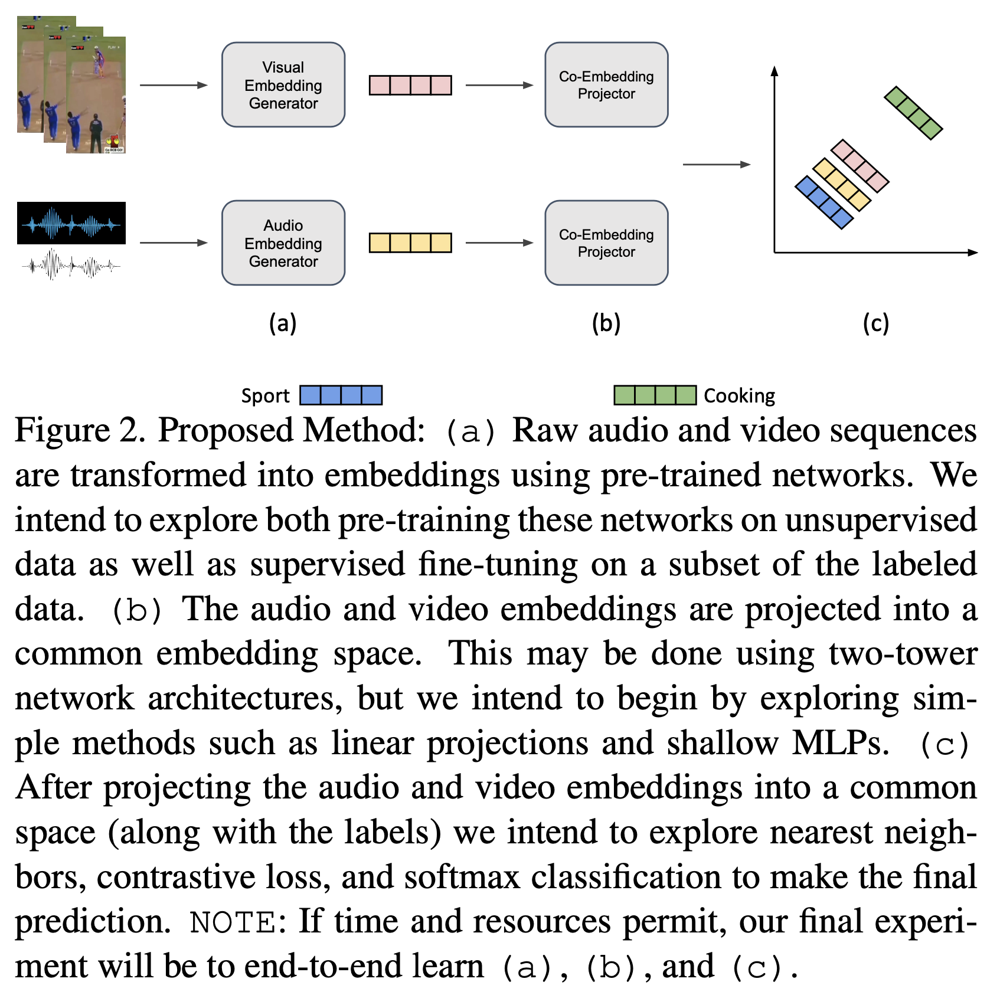

# fewshot-microvideo-recognition

Run the code/neural_network/pretrained_nn.ipynb file to generate results for table 1 row 1
Run the code/neural_network/concat_nn.ipynb file to generate results for table 1 row 1

Run the concat_nn.ipynb file to generate results for table 1 row 3

Run the knn.ipynb file to generate results for table 1 (rows 4, 5 and 6) and table 2

Two-tower network for co-embedding audio and video sequences for few-shot embedding learning.

